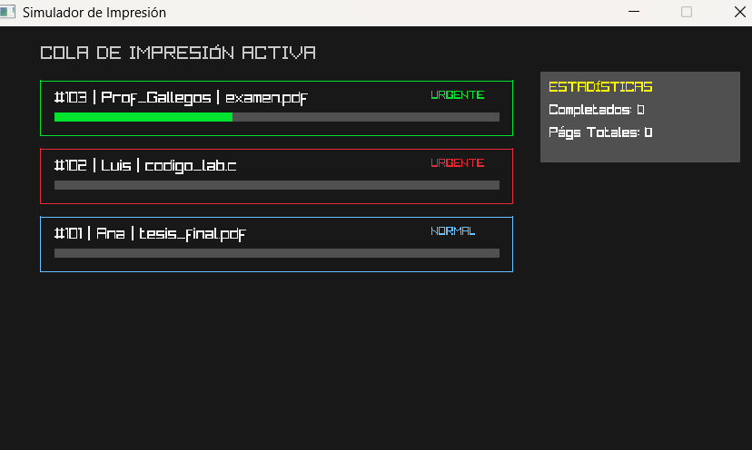

# Reporte de Práctica 01: Cola de Impresión

**Materia:** Paradigmas de la Programación  
**Docente:** M.I. José Carlos Gallegos Mariscal  
**Alumno:** Acevedo Carrillo Veronica y Josselyn Aleza Rivera Chavez [Tu Nombre]  
**Matrícula:** 380207  
**Grupo:** 941  

---

## 1. Introducción
En esta práctica se abordó la gestión de procesos mediante una **Cola de Impresión**. El objetivo principal fue implementar el algoritmo **FIFO (First-In, First-Out)** para administrar trabajos de impresión. Se desarrollaron tres fases: una implementación estática con arreglos, una dinámica con listas enlazadas y una simulación gráfica interactiva para observar el comportamiento de la memoria y la lógica de prioridades.

## 2. Diseño

### Definición de `PrintJob_t` e importancia de campos
En el código de las tres sesiones, se utilizó la estructura `PrintJob_t`. Sus campos críticos son:
* `id`: Permite el rastreo único del trabajo.
* `paginas_restantes`: Esencial para la Sesión 3, ya que permite que la simulación reste progreso sin perder el dato del `paginas_total`.
* `estado`: Un tipo `Estado_t` (enum) que permite controlar si el trabajo está `EN_COLA` o `IMPRIMIENDO`, facilitando la lógica visual.

### Diagrama de las Estructuras
* **Cola Estática (Sesión 1):** Utiliza un arreglo de tamaño fijo `MAX_JOBS`. El frente siempre es el índice 0 (`data[0]`).
* **Cola Dinámica (Sesión 2 y 3):** Implementada como lista enlazada. El `head` apunta al primer nodo y el `tail` al último para inserciones rápidas.

## 3. Implementación

### Lista de funciones principales
1. `qd_init`: Inicializa punteros a `NULL` para evitar basura en memoria.
2. `qd_enqueue_prioridad`: (Sesión 3) Inserta nodos. Si es `URGENTE`, lo coloca al frente de la cola.
3. `qd_dequeue`: Extrae el trabajo del `head` y ejecuta `free(temp)` para liberar el nodo.
4. `simular_impresion_raylib`: Ciclo de renderizado que maneja el tiempo y la lógica de estados.

### Decisiones relevantes
* **Validación de Memoria:** En la Sesión 2 se incluyó `if (!nuevo) return 0;` tras cada `malloc` para prevenir errores de segmentación.
* **Cola Circular vs Desplazamiento:** En la Sesión 1 se optó por un desplazamiento de elementos (*shift*) en el `dequeue` para mantener el frente en el índice 0, aceptando un costo de $O(n)$ por simplicidad.

## 4. Demostración de conceptos (Ejemplos del código)

### Alcance y duración
* **Local:** La variable `PrintJob_t temp` dentro de `qd_dequeue`. Se destruye al salir de la función.
* **Global/Static:** La variable `id_contador` en el `main`. Persiste durante toda la ejecución.
* **Dinámica:** La memoria asignada a `Node_t* nuevo`. Su alcance es global a través de punteros y su duración es manual hasta el `free`.

### Memoria
* **Stack:** Aquí se guarda la estructura `QueueDynamic_t cola`.
* **Heap:** Aquí se guardan los nodos creados con `malloc(sizeof(Node_t))`.
* **Liberación:** El código usa `free(temp)` en el `dequeue` y una función `qd_destroy` para limpiar toda la cola al cerrar el programa.

### Subprogramas
* **Punteros:** Se usan en `qd_enqueue(&cola, trabajo)` para que la función modifique la cola original (paso por referencia).
* **Const:** Se usa `const QueueDynamic_t* q` en `qd_is_empty` para asegurar que el subprograma sea de "solo lectura".

### Tipos de datos
* **struct:** Se utilizó `PrintJob_t` para encapsular datos de diferente naturaleza (int, char, enum).
* **enum:** Se utilizó `Prioridad_t` para evitar el uso de "números mágicos" (0 y 1) y hacer el código más legible.

## 5. Simulación
La simulación en Raylib avanza el progreso mediante la resta de páginas basada en el tiempo:
1. Se utiliza `timer += GetFrameTime();`.
2. Si el `timer >= 0.8f`, se ejecuta `actual->job.paginas_restantes--;`.
3. Cuando llega a 0, el trabajo se elimina con `qd_dequeue`.

**Evidencia de Simulación:**

## 6. Análisis comparativo: Estática vs Dinámica

La **cola estática** destaca por su simplicidad de implementación. Al residir en el *stack*, el acceso es sumamente rápido y no requiere gestión manual de memoria. Sin embargo, su principal debilidad es la inflexibilidad: si la cola se llena (`MAX_JOBS`), el sistema rechaza nuevos trabajos aunque el equipo tenga memoria disponible. Además, la operación de extracción es ineficiente ($O(n)$), ya que desplazar todos los elementos en un arreglo consume recursos innecesarios.

La **cola dinámica** resuelve estos problemas. Al utilizar el *heap*, la cola puede crecer teóricamente de forma ilimitada. Las operaciones de inserción y extracción son constantes ($O(1)$), lo que garantiza un rendimiento óptimo bajo cualquier carga. No obstante, el riesgo de "fugas de memoria" (*memory leaks*) es real si no se implementa una función de destrucción adecuada. En conclusión, para un sistema de impresión real, la implementación dinámica es la única opción viable por su escalabilidad.

## 7. Conclusiones
Con estas tres sesiones, se comprendió la importancia de la gestión de memoria manual en C. Se aprendió que la abstracción de una "Cola" puede implementarse de diversas formas según la necesidad de rendimiento. La inclusión de Raylib permitió visualizar de una mejor manera cómo los datos en el *heap* cambian de estado en tiempo real. Se mejoraría el sistema añadiendo una persistencia en archivos (JSON o binario) para no perder la cola al cerrar el programa.

## 8. Referencias
* Gallegos, J. C. (2026). *Notas de clase: Paradigmas de la Programación*. UABC.
* Kernighan, B. W., & Ritchie, D. M. (1988). *The C Programming Language*. Prentice Hall.
* Raylib. (2026). *Documentation and Examples*. https://www.raylib.com

---
## 9. Enlaces de la Entrega
Veronica Acevedo Carrillo
* **Repositorio:** [GitHub - portafolio_Paradigma](https://github.com/veroni384/portafolio_Paradigma)
* **Página Publicada:** [Práctica 01 - My New Hugo Site](https://veroni384.github.io/portafolio_Paradigma/practica1/)

Josselyn Rivera Chavez
* **Repositorio:** [GitHub - portafolio_Paradigma](https://github.com/veroni384/portafolio_Paradigma)
* **Página Publicada:** [Práctica 01 - My New Hugo Site]()
