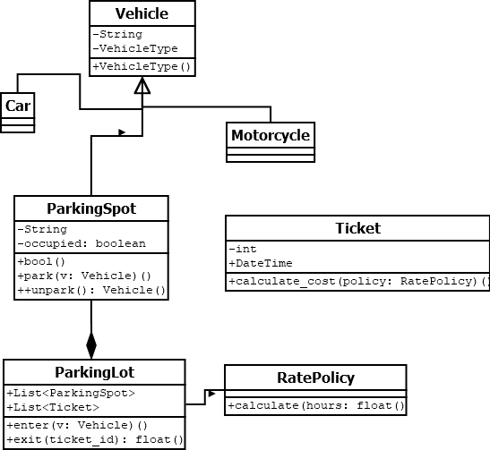
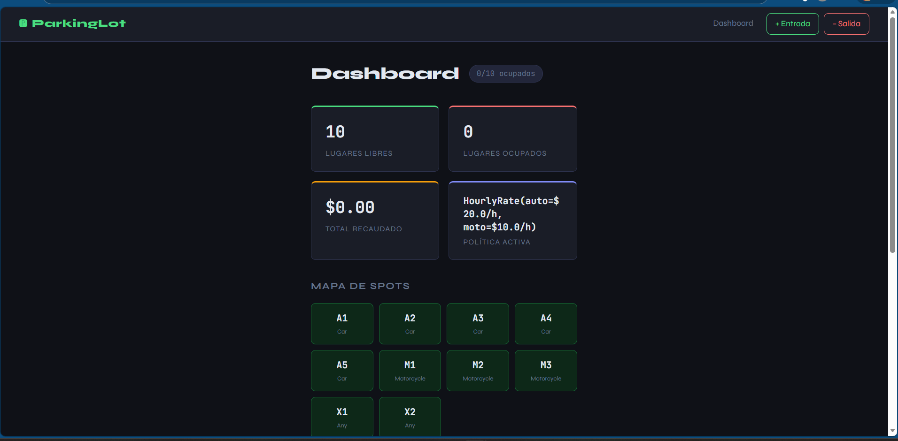
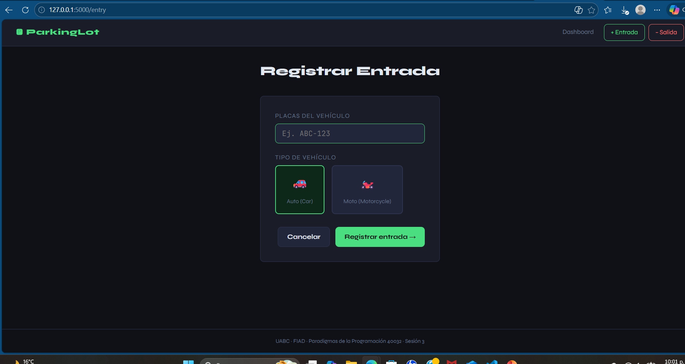
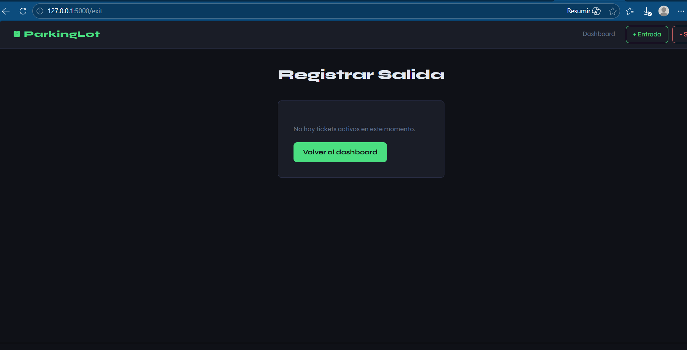

+++
date = '2026-02-17T17:46:34-08:00'
draft = false
title = 'Practica2'
+++

# Reporte de Práctica 02: Simulador de Estacionamiento

**Materia:** Paradigmas de la Programación  
**Docente:** M.I. José Carlos Gallegos Mariscal  
**Alumno:** Acevedo Carrillo Veronica y Josselyn Alexa Rivera Chavez  
**Matrícula:** 380207 y 379219  
**Grupo:** 941  

---

## 1. Introducción

En la presente práctica se desarrolló un sistema de simulación de estacionamiento utilizando Programación Orientada a Objetos (POO) en Python.

El sistema permite registrar la entrada y salida de vehículos, asignar espacios, calcular costos y visualizar la ocupación. Además, se implementó una interfaz web utilizando Flask siguiendo el patrón Modelo-Vista-Controlador (MVC).

---
##  Preguntas Guía
1. **¿Qué clase asigna los spots?** `ParkingLot`, ya que conoce la disponibilidad total.
2. **¿Qué ventaja da el polimorfismo?** Permite agregar nuevas tarifas sin modificar el código base.
3. **¿Por qué usar atributos privados?** Para evitar que se corrompa el estado de los lugares desde fuera del modelo.
## 2. Modelo del dominio

### Clases principales

- **Vehicle, Car, Motorcycle**
- **ParkingSpot**
- **Ticket**
- **ParkingLot**
- **RatePolicy**

---

### Diagrama UML (simplificado)
### Diagrama UML Detallado
El siguiente diagrama muestra la jerarquía de herencia y cómo se relacionan las clases mediante composición y protocolos.



├── ParkingSpot

├── Ticket

└── RatePolicy

Vehicle

├── Car

└── Motorcycle

---

## 3. Evidencia de conceptos de POO

### 3.1 Encapsulamiento

Se utilizan atributos privados para proteger el estado:
```python
self._occupied = False
self._current_vehicle: Vehicle | None = None

def park(self, vehicle: Vehicle) -> None:
    if self._occupied:
        raise ValueError(f"El lugar {self._spot_id} ya está ocupado.")
```

### 3.2 Abtracción

Se define un contrato para el cálculo de tarifas:
```python
class RatePolicy(Protocol):
    def calculate(self, hours: float, vehicle: Vehicle) -> float: ...
```

### 3.3 Herencia
```python
class Vehicle:
    ...

class Car(Vehicle):
    def __init__(self, plate: str):
        super().__init__(plate, VehicleType.CAR)
```

### 3.4 Polimorfismo
```python
class HourlyRatePolicy:
    def calculate(self, hours: float, vehicle: Vehicle) -> float:
        rate = self._car_rate if vehicle.get_type() == VehicleType.CAR else self._moto_rate
        return round(hours * rate, 2)
```

### 3.5 Composición
```python
class ParkingLot:
    def __init__(self, rate_policy: RatePolicy) -> None:
        self._spots: list[ParkingSpot] = []
        self._tickets: list[Ticket] = []
        self._rate_policy = rate_policy
```

## 4. Implementación
Validación de disponibilidad
```python
def is_available_for(self, vehicle: Vehicle) -> bool:
    if self._occupied:
        return False
```
Cierre de ticket
```python
def close(self, exit_time: datetime) -> None:
    if self._status == TicketStatus.CLOSED:
        raise ValueError("El ticket ya fue cerrado.")
```
Cálculo de tiempo
```python
def get_duration_hours(self) -> float:
    delta = self._exit_time - self._entry_time
    return max(delta.total_seconds() / 3600, 1.0)
```

## 5. Invariantes del sistema
* Un lugar solo puede tener un vehículo
* No se puede ocupar un lugar ocupado
* No se puede cerrar un ticket cerrado
* No se permite salida antes de entrada

## 6. Pruebas del sistema





Consola

Entrada: ABC-123 → Spot A1

Entrada: XYZ-777 → Spot M1

Salida: Ticket #1 → $40

Polimorfismo
* Hourly → $40
* Flat → $50

## 7. Arquitectura MVC (Flask)


* models/vehicle.py
* models/spot.py
* models/ticket.py
* models/rates.py

View
* dashboard.html
* entry.html
* exit.html

Controller
```python
@app.route("/")
def dashboard():
    occ = lot.get_occupancy()
    tickets = lot.get_active_tickets()
    return render_template("dashboard.html", occ=occ, tickets=tickets)
```
Registro de entrada (POST)
```python
vehicle = Car(plate) if vtype == "Car" else Motorcycle(plate)
ticket = lot.enter(vehicle, datetime.now())
```
Registro de salida
```python
costo = lot.exit(ticket_id, datetime.now())
```
Cambio de política (polimorfismo real)
```python
if choice == "hourly":
    lot.set_policy(HourlyRatePolicy(20.0, 10.0))
elif choice == "flat":
    lot.set_policy(FlatRatePolicy(amount))
elif choice == "discounted":
    lot.set_policy(DiscountedMotoPolicy(20.0, 0.5))
```

### 8. Conclusiones

La POO permitió diseñar un sistema modular, organizado y escalable.

El encapsulamiento protegió los datos, la abstracción separó responsabilidades, y el polimorfismo permitió cambiar la lógica de cobro sin afectar el sistema.

La implementación con Flask permitió integrar una interfaz web funcional basada en MVC.

### 9. Referencias
Documentación de Python
Documentación de Flask
Material de clase

### 10. Enlaces de la Entrega
Veronica Acevedo Carrillo
* Repositorio:[GitHub - portafolio_Paradigma](https://github.com/veroni384/portafolio_Paradigma)
* Página Publicada: Práctica 02 [Practica 2](https://veroni384.github.io/portafolio_Paradigma/practica2/)

Josselyn Alexa Rivera Chavez
* **Repositorio:** [GitHub - portafolio_Paradigma](https://github.com/JosselynAlexa/portafolio-PP)
* **Página Publicada:** [Práctica 02 - My New Hugo Site](https://josselynalexa.github.io/portafolio-PP/practica2/)