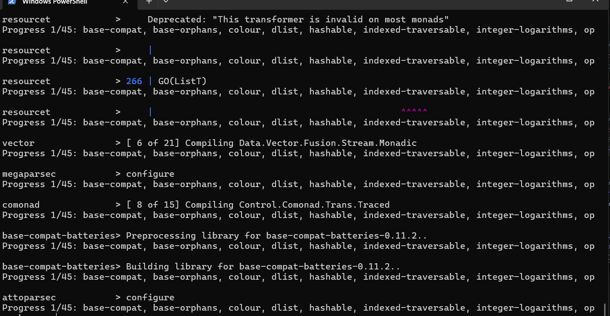
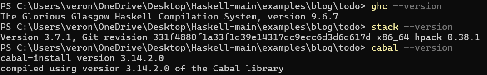
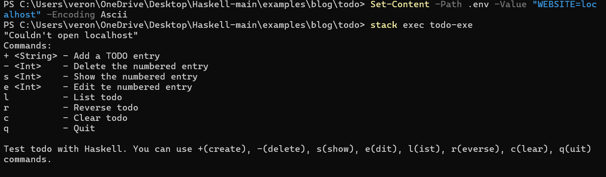

+++
date = '2026-02-17T17:47:03-08:00'
draft = false
title = 'Practica3'
+++
# Reporte de Práctica: Instalación del Entorno Haskell y Ejecución de Aplicación TODO

## 1. Introducción
El objetivo de esta práctica consistió en la configuración integral del ecosistema de programación funcional **Haskell** en un entorno Windows 10/11. Se exploró el uso de herramientas de automatización como **Stack** para la gestión de dependencias y la compilación de una aplicación real de gestión de tareas (TODO list), analizando las particularidades del lenguaje y su rigor técnico.

## 2. Sesión 1: Configuración del Entorno de Desarrollo
Para establecer un entorno robusto, se utilizó el instalador oficial **GHCup**. Este proceso permitió la instalación y gestión de las tres herramientas fundamentales del ecosistema Haskell:

* **GHC (Glasgow Haskell Compiler):** El compilador de alto rendimiento para Haskell. Se instaló la versión 9.6.7.
* **Stack:** Herramienta para el desarrollo de proyectos que garantiza que todas las dependencias sean compatibles entre sí.
* **Cabal:** Sistema de infraestructura de paquetes para bibliotecas y aplicaciones Haskell.

### Evidencia de Instalación
Tras la configuración de las variables de entorno, se verificó el funcionamiento mediante la terminal:

>
> ****
>
> ****

---

## 3. Sesión 2: Implementación de la Aplicación TODO
Se utilizó el código fuente de la aplicación TODO proporcionado en el repositorio de *Steady Learner*. El flujo de trabajo para la implementación fue el siguiente:

### 3.1 Construcción del Proyecto
Se utilizó el comando `stack build` dentro del directorio del proyecto. Este comando automatizó tareas complejas:
1.  **Instalación de MSYS2:** Configuración de un entorno Unix-like necesario para herramientas de construcción en Windows.
2.  **Resolución de Dependencias:** Descarga y compilación de 45 paquetes externos, incluyendo librerías críticas como `vector` (manejo de arreglos), `resourcet` y `megaparsec` (parsing de datos).

### 3.2 Resolución de Conflictos (Debugging)
Durante la fase de ejecución, se presentaron errores de entrada/salida (IO) que permitieron analizar la seguridad de Haskell:
* **Archivo .env:** La aplicación requería obligatoriamente un archivo de configuración. Haskell detuvo el proceso al no encontrarlo, evitando ejecuciones con datos nulos.
* **Codificación de Caracteres:** Se solucionó un error de lectura causado por la marca de orden de bytes (BOM) al crear el archivo con codificación incompatible. Se corrigió forzando el formato **ASCII/UTF-8**.
* **Variables de Entorno:** Se configuró la variable `WEBSITE=localhost` requerida por la lógica interna de la aplicación.

---

## 4. Funcionamiento de la Aplicación
Una vez resueltos los requisitos de entorno, la aplicación se inició con éxito mediante el comando `stack exec todo-exe`. 

### Interfaz de Comandos (CLI)
La aplicación presenta un menú basado en comandos de texto simple, lo que demuestra la eficiencia de Haskell para procesar entradas de usuario de forma recursiva:

* `+`: Añadir una nueva tarea.
* `l`: Listar las tareas actuales.
* `-`: Eliminar una tarea por su índice.
* `q`: Salir de la aplicación.

> ****

---

## 5. Conclusiones
La práctica demostró que Haskell, a pesar de ser un lenguaje con una curva de aprendizaje pronunciada, ofrece herramientas de gestión de proyectos (como **Stack**) extremadamente potentes que garantizan la reproducibilidad del software. 

Se observó que el sistema de tipos y el manejo de efectos secundarios en Haskell obligan al desarrollador a tratar los errores de configuración (como archivos faltantes o codificaciones incorrectas) de manera preventiva, resultando en aplicaciones mucho más robustas y seguras en comparación con el paradigma imperativo tradicional.

---
**Fecha:** 17 de abril de 2026  
**Herramientas usadas:** GHCup, GHC, Stack, PowerShell.

Veronica Acevedo Carrillo 380207
* Repositorio:[GitHub - portafolio_Paradigma](https://github.com/veroni384/portafolio_Paradigma)
* Página Publicada: [Práctica 03 - My New Hugo Site](https://veroni384.github.io/portafolio_Paradigma/practica3/)
